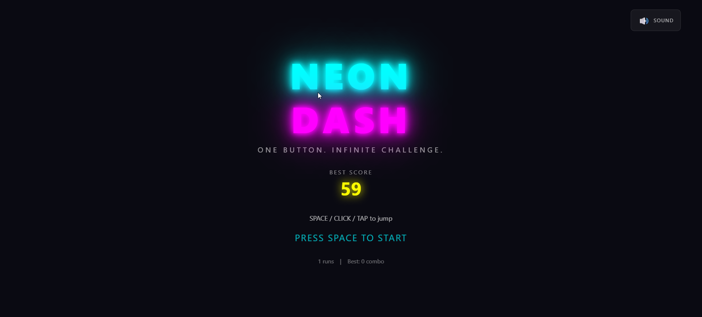
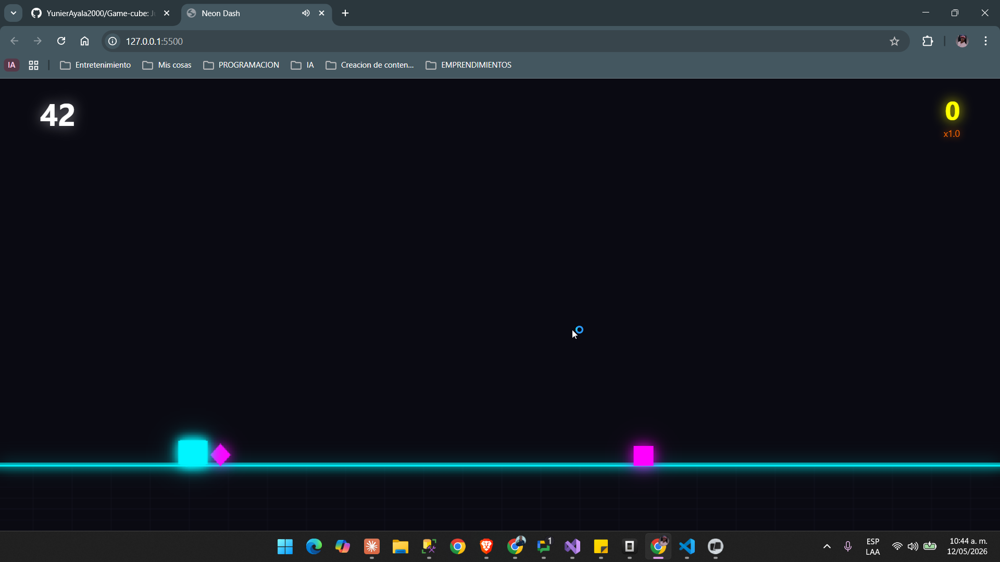

# Neon Dash

A fast-paced, one-button arcade game with a cyberpunk synthwave aesthetic. Control a glowing neon cube as it dashes through an endless obstacle course.

## Screenshots




## Quick Start

**Option 1 - Direct:**
Open `index.html` directly in your browser.

**Option 2 - With Server:**
```bash
npm start
```
Then open http://localhost:3000 in your browser.

## Controls

| Input | Action |
|-------|--------|
| Space / Enter | Jump |
| Mouse Click | Jump |
| Touch Tap | Jump |

You can:
- Hold the button for a slightly higher jump
- **Double jump** in mid-air for extra height!

## Game Mechanics

### Scoring
- +0.1 points per frame (scales with multiplier)
- Near-miss bonuses: +50 (close) or +100 (extreme)
- Multiplier increases with consecutive dodges

### Near-Miss System
Get close to obstacles without touching them to earn bonus points and build combos. The closer you get, the bigger the reward!

### Combo System
- Each obstacle dodged adds +1 to your combo
- Multiplier: 1x base, +0.1x per combo (caps at 3x)
- Combo milestones (10, 25, 50) trigger slow-motion effects
- Missing 3 obstacles in a row ends the game

### Difficulty Scaling
- Speed increases every 5 seconds
- Obstacle frequency increases over time
- New obstacle patterns unlock as you progress
- Intense waves appear after 30 seconds

### Double Jump
- Press jump again while in the air to perform a double jump!
- The second jump has a distinct yellow particle burst
- Use it strategically to reach higher obstacles or avoid tricky patterns

### Special Moments
- **Slow Motion**: Triggered at combo milestones - the world slows down dramatically
- **Hyper Speed**: Random chance after 60 seconds - double speed for 3 seconds!

## Features

### Visual Effects
- Neon glow and bloom effects
- Particle systems (jump, land, near-miss, death, double jump)
- Screen shake on impacts
- Motion trails behind the player
- Animated background grid
- Squash/stretch animations

### Obstacles
- Multiple shapes: squares, triangles (spikes), diamonds, circles
- Various patterns and formations
- Each shape has unique collision detection

### Sound
- Synthesized sound effects (Web Audio API)
- Jump, score, near-miss, combo, death, and high score sounds
- Toggle sound on/off with the button in the corner

### Progression
- Best score saved locally
- Statistics tracked: total runs, longest combo, near-misses
- Medals awarded based on score:
  - Bronze: 100 points
  - Silver: 1,000 points
  - Gold: 5,000 points
  - Neon God: 25,000 points

### Unlockable Themes
- Cyan (default)
- Pink
- Orange
- Green
- Void

Themes unlock based on total score achieved across all runs.

## Technical Details

- Pure HTML5, CSS3, and JavaScript
- No external dependencies
- Canvas-based rendering at 60 FPS
- Object pooling for particles
- Works offline
- Responsive design (mobile-friendly)

## Browser Compatibility

Works in all modern browsers:
- Chrome (recommended)
- Firefox
- Edge
- Safari
- Opera

## File Structure

```
neon-dash/
├── index.html    # Main HTML structure
├── style.css     # All styling and animations
├── script.js     # Complete game logic
├── server.js     # Simple HTTP server (built-in Node.js)
├── package.json  # Project config
└── README.md     # This file
```

## Tips

1. **Timing is everything**: Watch the patterns and time your jumps
2. **Master the double jump**: Use it wisely - you only have one in the air!
3. **Take risks for near-misses**: They're worth the points and feel great
4. **Watch your combo**: Higher combos mean higher scores
5. **Breathe**: The game gets intense - stay calm

## Credits

Inspired by Geometry Dash, Super Hexagon, and classic arcade games.

---

**Play now! Open `index.html` in your browser.**

Good luck, and may your reflexes be swift! ⚡
